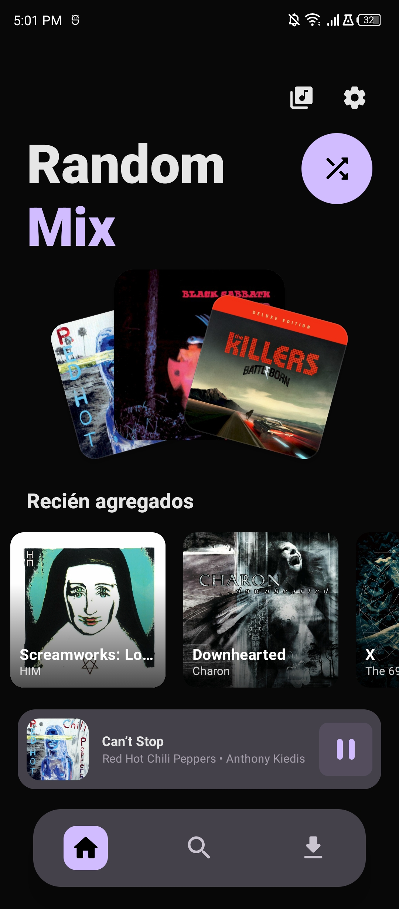
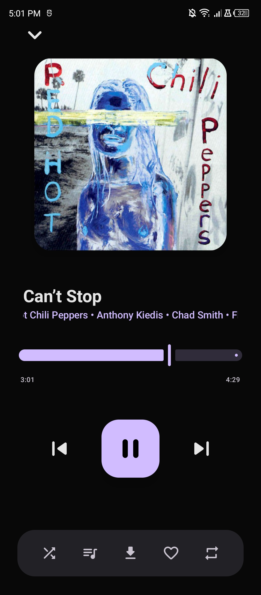
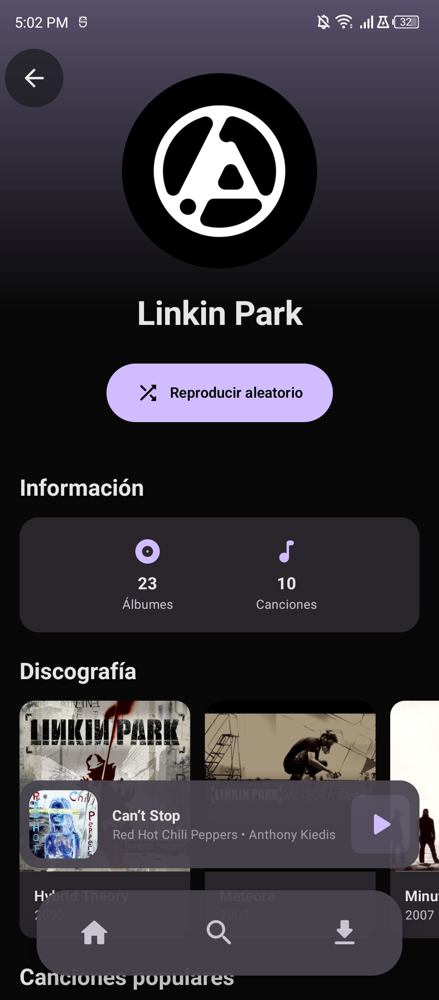

# NeoSynth

Cliente de música moderno para Android que se conecta a servidores Navidrome y Subsonic.

## Descripción

NeoSynth es una aplicación nativa de Android desarrollada con Jetpack Compose y Material Design 3, que permite reproducir tu biblioteca musical personal desde cualquier servidor compatible con Navidrome o la API de Subsonic.

## Características Principales

### Reproducción de Audio
- Streaming en tiempo real desde el servidor
- Reproducción en segundo plano con notificaciones de control
- Cola de reproducción con soporte para shuffle y repeat
- Mini reproductor persistente durante la navegación
- Reproductor de pantalla completa con controles gestuales
- Integración con Google Assistant para comandos de voz

### Gestión de Contenido
- Descarga de canciones individuales, álbumes completos y playlists
- Descargas en segundo plano con WorkManager
- Reproducción offline de contenido descargado
- Organización alfabética con sticky headers
- Modo de selección múltiple
- Sistema de favoritos sincronizado con el servidor

### Interfaz de Usuario
- Carrusel de álbumes recién agregados
- Mix aleatorio
- Menú contextual en álbumes (reproducir, shuffle, descargar, ir al artista)
- Theming dinámico basado en Material You
- Soporte para tema claro y oscuro

### Multi-servidor
- Soporte para múltiples servidores Navidrome/Subsonic
- Autenticación segura con tokens MD5
- Cambio rápido entre servidores

## Requisitos del Sistema

**Versiones de Android Compatibles:**
- Mínimo: Android 9.0 Pie (API 28)
- Objetivo: Android 15 (API 35)

**Servidor:**
- Navidrome o cualquier servidor compatible con Subsonic API

## Capturas de Pantalla

  
  
  

## Tecnologías

- Kotlin 2.0
- Jetpack Compose
- Material Design 3
- Hilt (Inyección de dependencias)
- Room (Base de datos local)
- Retrofit (Cliente HTTP)
- Media3/ExoPlayer (Reproducción de audio)
- WorkManager (Tareas en background)
- Coroutines y Flow

## Documentación

Para información detallada sobre arquitectura, instalación, configuración y desarrollo, consulta la carpeta `docs/`:

- [Arquitectura del Proyecto](docs/ARCHITECTURE.md)
- [Configuración y Uso](docs/CONFIGURATION.md)
- [Stack Tecnológico](docs/TECH_STACK.md)
- [Material Design 3](docs/MATERIAL_DESIGN.md)
- [API de Navidrome](docs/NAVIDROME_API.md)

## Licencia

Este proyecto está bajo la Licencia MIT. Ver el archivo `LICENSE` para más detalles.
