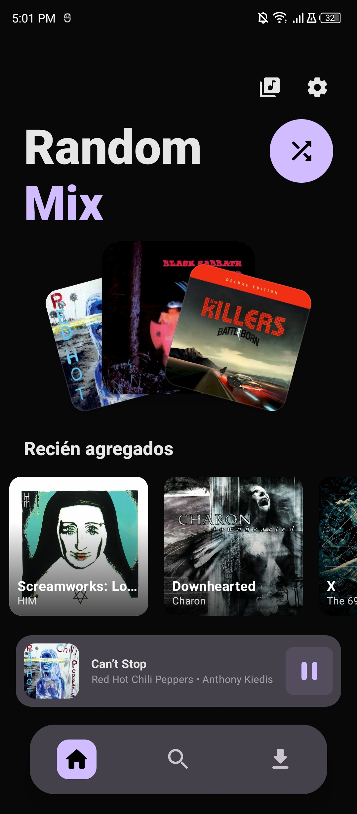
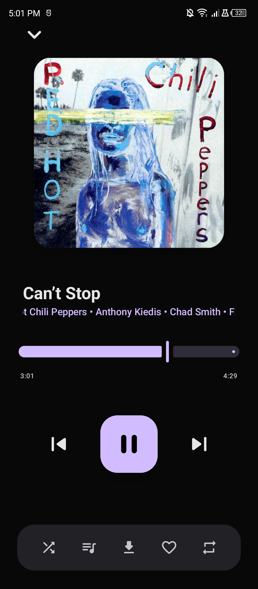
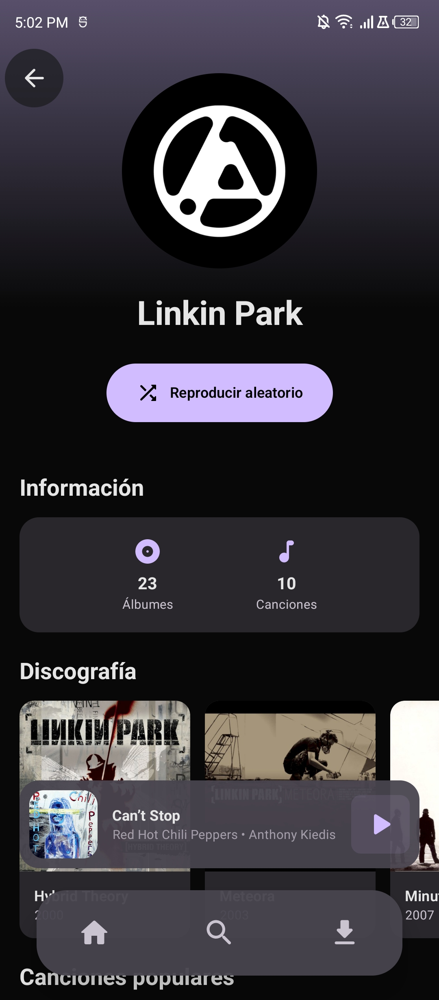

# NeoSynth

Modern music client for Android that connects to Navidrome and Subsonic servers.

## Description

NeoSynth is a native Android application built with Jetpack Compose and Material Design 3, allowing you to play your personal music library from any server compatible with Navidrome or the Subsonic API.

## Main Features

### What's New in v2.2.0 (March 2026)
- Advanced lyrics system with integrated editor, interactive synchronization, and LRC support
- Missing lyrics generation with AI (Gemini 2.0)
- Lyrics publishing to LRCLib with Proof of Work (PoW)
- Automatic fallback between LRCLIB and Netease Cloud Music
- Adaptive HomeScreen in offline mode (Random Mix and recent additions from local content)
- Advanced queue reordering with drag-and-drop and auto-scroll
- Preservation of original queue order when toggling shuffle
- Optional audio visualizer from settings
- Immersive mode on player and lyrics screen

### Audio Playback
- Real-time streaming from server
- Background playback with control notifications
- Playback queue with support for shuffle and repeat
- Persistent mini player during navigation
- Full-screen player with gesture controls

### Content Management
- Download individual songs, complete albums, and playlists
- Background downloads with WorkManager
- Offline playback of downloaded content
- Alphabetical organization with sticky headers
- Multi-select mode
- Favorites system synchronized with server

### Lyrics (Lyrics Engine)
- Integrated lyrics editor in the app
- Interactive line synchronization during playback
- Assisted lyrics generation with Gemini 2.0
- Publishing to LRCLib with PoW validation
- Multi-provider resolution with automatic fallback (LRCLIB/Netease)

### User Interface
- Carousel of recently added albums
- Random Mix
- Context menu on albums (play, shuffle, download, go to artist)
- Dynamic theming based on Material You
- Support for light and dark themes

### Multi-server
- Support for multiple Navidrome/Subsonic servers
- Secure authentication with MD5 tokens
- Quick switching between servers

## System Requirements

**Compatible Android Versions:**
- Minimum: Android 9.0 Pie (API 28)
- Target: Android 15 (API 35)

**Server:**
- Navidrome or any server compatible with Subsonic API

## Screenshots

  
  
  

## Technologies

- Kotlin 2.0
- Jetpack Compose
- Material Design 3
- Hilt (Dependency Injection)
- Room (Local Database)
- Retrofit (HTTP Client)
- Media3/ExoPlayer (Audio Playback)
- WorkManager (Background Tasks)
- Coroutines and Flow

## Documentation

For detailed information about the project, check the `docs/` folder:

- [Project Architecture](docs/ARCHITECTURE.md) - Design patterns, layers, data flow
- [Functions and Components](docs/FUNCTIONS.md) - Detailed documentation of ViewModels, Repositories, Workers, Services, and utilities
- [Configuration and Usage](docs/CONFIGURATION.md) - Installation and setup
- [Tech Stack](docs/TECH_STACK.md) - Technologies used
- [Material Design 3](docs/MATERIAL_DESIGN.md) - Style guide and components
- [Navidrome API](docs/NAVIDROME_API.md) - Endpoints documentation

## Technical Features

### Download System
- Hybrid strategy with batches of 10 songs in parallel
- WorkManager for persistence and automatic retries
- Atomic counter for real-time progress
- Complete offline support with visual indicators

### Playback
- Media3 (ExoPlayer) for high-quality playback
- MediaSessionService for system controls
- Notifications with playback controls
- Playback queue with drag & drop reordering and auto-scroll
- Preservation of original order when toggling shuffle

### Synchronization
- Repository pattern as single source of truth
- Bidirectional synchronization (local ↔ server)
- Batch operations to optimize API calls
- Smart caching with Room Database

### User Interface
- Material Design 3 with Dynamic Color
- 100% Jetpack Compose
- Skeletons that match actual content exactly
- Smooth animations and transitions
- Immersive mode on playback and lyrics screens

## Changelog v2.2.0

### Recent Fixes and Improvements
- Lyrics navigation fix: resolved gesture conflict when tapping lines
- More stable downloads: improvements in DownloadWorker for persistent notifications and network errors
- Player UI synchronization: prevents briefly showing next song metadata on quick swipes
- Lyrics cache management: failed responses are no longer cached, forcing clean retries

## License

This project is under the MIT License. See the `LICENSE` file for more details.
