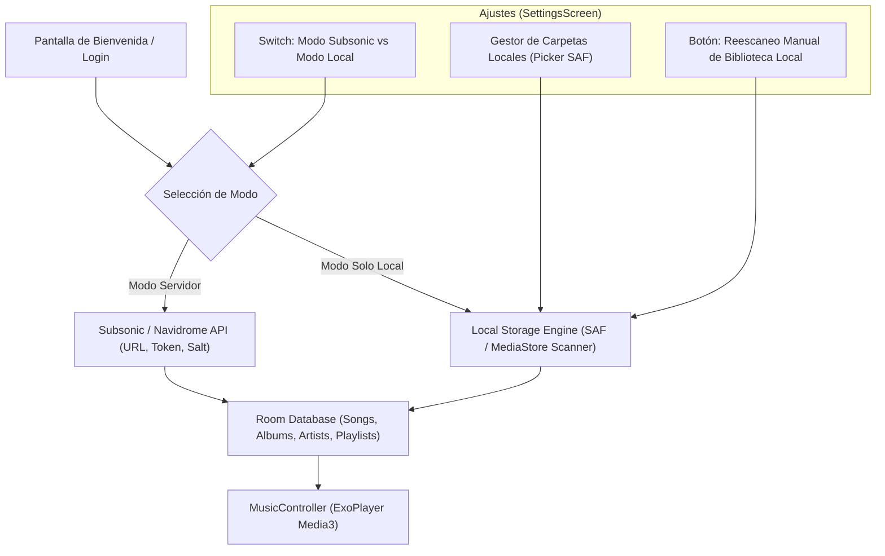

# 📋 Plan de Arquitectura: Modo de Almacenamiento Local Independiente (NeoSynth)

Este documento detalla la estrategia completa de arquitectura para permitir que **NeoSynth** funcione de manera 100% independiente con archivos locales del dispositivo (MP3, FLAC, M4A, Opus, WAV), sin depender obligatoriamente de un servidor Navidrome/Subsonic, permitiendo además alternar limpiamente entre ambos modos o elegir el modo solo local desde el primer inicio.

---

## 📐 1. Resumen de Arquitectura y Estado de la App



---

## 🔐 2. Rediseño del Flujo de Bienvenida / Login

Actualmente, `LoginScreen.kt` exige ingresar `Server URL`, `Username` y `Password`.

### 💡 Cambios Propuestos en `LoginScreen.kt`:
1. **Selector Inicial de Modo**:
   - Tarjeta 1: **"Conectar a Servidor Subsonic / Navidrome"** (Flujo existente).
   - Tarjeta 2: **"Usar Biblioteca Local"** (Sin necesidad de servidor ni credenciales).
2. **Acción de "Usar Biblioteca Local"**:
   - Al presionar esta opción, se solicita el permiso de almacenamiento (`READ_MEDIA_AUDIO` en Android 13+ o `READ_EXTERNAL_STORAGE` en versiones anteriores).
   - Se guarda el flag `appSettings.musicSourceMode = AppMusicSourceMode.LOCAL`.
   - Se ejecuta el escaneo inicial y se navega directamente a la pantalla principal (`Home`).

---

## ⚙️ 3. Modificaciones en la Base de Datos y Preferencias

### 3.1. DataStore (`SettingsPreferences.kt`)
Se agregan los siguientes campos en `AppSettings`:
```kotlin
enum class AppMusicSourceMode {
    SUBSONIC, // Servidor Navidrome / Subsonic
    LOCAL     // Archivos locales del dispositivo
}

data class AppSettings(
    val musicSourceMode: AppMusicSourceMode = AppMusicSourceMode.SUBSONIC,
    val localFolderUris: Set<String> = emptySet(), // URIs de carpetas SAF seleccionadas
    val autoScanLocalOnStart: Boolean = true
    // ... otros ajustes existentes
)
```

### 3.2. Room Database (`SongEntity`, `AlbumEntity`, `ArtistEntity`)
Las entidades ya cuentan con los campos `isLocal: Boolean` y `path: String`.
- Para archivos locales: `isLocal = true` y `path = "file:///storage/emulated/0/Music/song.mp3"` o URI de documento SAF.

---

## 📂 4. Escáner e Indizador de Música Local (`LocalMusicScanner`)

Se creará un servicio dedicado `LocalMusicScanner.kt` ubicado en `com.example.neosynth.data.local.scanner`.

### Funcionalidad:
1. **Escaneo vía MediaStore (Fast Scan)**:
   - Consulta `android.provider.MediaStore.Audio.Media.EXTERNAL_CONTENT_URI`.
   - Filtra canciones con `IS_MUSIC != 0` y de duración `> 30` segundos.
   - Extrae metadatos (Título, Artista, Álbum, Año, Duración, Tasa de bits, Carátula embellecida).
2. **Escaneo por Carpetas Específicas (Storage Access Framework / SAF)**:
   - Si el usuario especifica carpetas personalizadas en Ajustes, se utiliza `DocumentFile.fromTreeUri(context, uri)` para indexar recursivamente solo los archivos dentro de esas rutas elegidas.
3. **Generador de Portadas Locales (`LocalArtworkExtractor`)**:
   - Extrae las portadas incrustadas mediante `MediaMetadataRetriever` y las almacena en la caché de la app para mostrarlas fluido en la UI sin depender de internet.

---

## 🛠️ 5. Nueva Sección en Ajustes (`SettingsScreen.kt`)

En `SettingsScreen.kt`, bajo la sección de **Servidor y Cuenta**, se agregará la subsección **Origen de Música y Carpetas Locales**:

1. **Switch de Origen de Música**:
   - **"Modo de Operación"**: Toggle entre **Servidor Subsonic** y **Biblioteca Local**.
2. **Administrador de Carpetas Locales**:
   - Muestra la lista de carpetas añadidas (ej: `/storage/emulated/0/Music`, `/storage/emulated/0/Download`).
   - Botón `[+] Añadir Carpeta` (Abre el selector nativo SAF `Intent.ACTION_OPEN_DOCUMENT_TREE`).
   - Botón `[🗑]` para remover carpetas.
3. **Reescaneo Manual**:
   - Botón **"Rescanear Biblioteca Local"** con indicador de progreso animado (`"Escaneando 142 canciones..."`).

---

## 🔄 6. Fases de Implementación Sugeridas

| Fase | Tarea | Descripción |
| :--- | :--- | :--- |
| **Fase 1** | **Preferencias & DataStore** | Añadir `AppMusicSourceMode` y almacenamiento de `localFolderUris` en `SettingsPreferences.kt`. |
| **Fase 2** | **Rediseño de LoginScreen** | Agregar opción "Usar Biblioteca Local" en `LoginScreen.kt` sin pedir servidor. |
| **Fase 3** | **LocalMusicScanner Engine** | Crear el servicio de escaneo de archivos locales (MediaStore + SAF) con extracción de metadatos y portadas. |
| **Fase 4** | **Configuración en Settings** | Agregar el Switch de origen de música y la lista de carpetas seleccionadas en `SettingsScreen.kt`. |
| **Fase 5** | **Integración del Reproductor** | Asegurar que `HomeViewModel`, `DiscoverViewModel` y `LibraryViewModel` consuman la biblioteca de Room filtrando por `isLocal` según el modo activo. |
